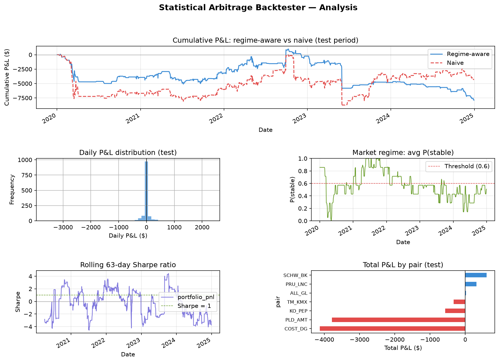

# Statistical Arbitrage Backtester with Regime-Dependent Cointegration
A quantitative trading research project that simulates a statistical arbitrage strategy on historical S&P 500 stock data. The strategy identifies cointegrated pairs of stocks, generates mean-reversion trading signals, and adjusts position sizes based on market regime detection using a Hidden Markov Model.

# Pipeline
The project runs as a sequential 7-step pipeline:

config.py: stores all parameters
- data loader: download and clean historical price data
- pair selection: identify cointegration tickers using statistical tests
- spread Kalman: compute time-varying hedge-ratios using Kalman Filter
- regime HMM: detect market regimes (stable v. crisis) using Hidden Markov Model
- signals: generate z-score entry/exit signals scaled by regime (regime-dependent)
- backtester: simulates P&L, taking into account transaction costs
- analysis: produce performance reports and charts

# Methodology
Pair Selection:
Candidate pairs are tested within the same sector to ensure a fundamental economic basis for the relationship. Each pair must pass three filters:
- ADF test — each stock individually must be non-stationary (a prerequisite for cointegration)
- Engle-Granger cointegration test — the spread between the two stocks must be stationary (p-value < 0.05)
- Half-life filter — the spread must revert within 5 to 60 days

Time-Varying Hedge Ratio:
Rather than a fixed hedge ratio computed once on training data, a Kalman filter tracks how the relationship between each pair evolves day by day. This accounts for the fact that the ratio between two stocks drifts gradually over time.

Regime Detection:
A 2-state Gaussian Hidden Markov Model is fit on three features derived from each pair's spread:
- Rolling spread volatility
- Z-score of the spread
- Volatility of volatility

The model outputs P(stable) at each timestep — a probability between 0 and 1. Position sizes are multiplied by P(stable), so exposure fades continuously as market conditions deteriorate rather than using a hard binary switch.

Signal Generation:
The spread is converted to a rolling z-score using a 60-day window. Trading rules:
- Entry: |z| > 2.0 → enter trade in the direction of reversion
- Exit: z crosses 0 → spread has normalised, close position
- Stop loss: |z| > 3.5 → emergency exit if spread keeps blowing out

Backtesting:
Signals are applied with a one-day lag to prevent lookahead bias. Transaction costs of 5 basis points per leg are applied on every position change. $10,000 is allocated per pair.

# Performance Evaluation
The model is trained on 2010–2019 data and evaluated on the unseen 2020–2024 test period. Key metrics reported:
- Sharpe ratio (annualized)
- Maximum drawdown
- Win rate
- Regime-conditional performance (stable vs crisis days separately)
- Regime-aware vs naive strategy comparison

# Installation 
pip install yfinance pandas numpy statsmodels hmmlearn scikit-learn matplotlib

# Known Limitations
- Uses Engle-Granger cointegration which is asymmetric where pair order affects results & pairing method with combinations as opposed to permutations. A future improvement would be to use the Johansen test.
- The Kalman filter assumes the hedge ratio changes smoothly and may be slow to respond to sudden structural breaks.
- Regime detection uses the same HMM parameters for all pairs rather than calibrating per pair.

# Universe Results

Attached above are the results of the backtester performance 2020–2024 out-of-sample test period across 7 cointegrated pairs.
Graphs:

- Cumulative P&L: regime-aware (blue) v. naive (red)
- Daily P&L Distribution
- Market Regime: Average P(stable)
- Rolling Sharpe Ratio
- Total P&L by Pair
